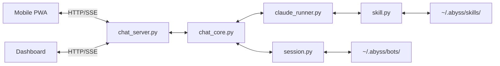
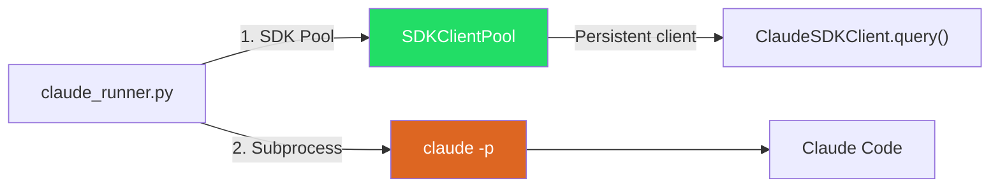
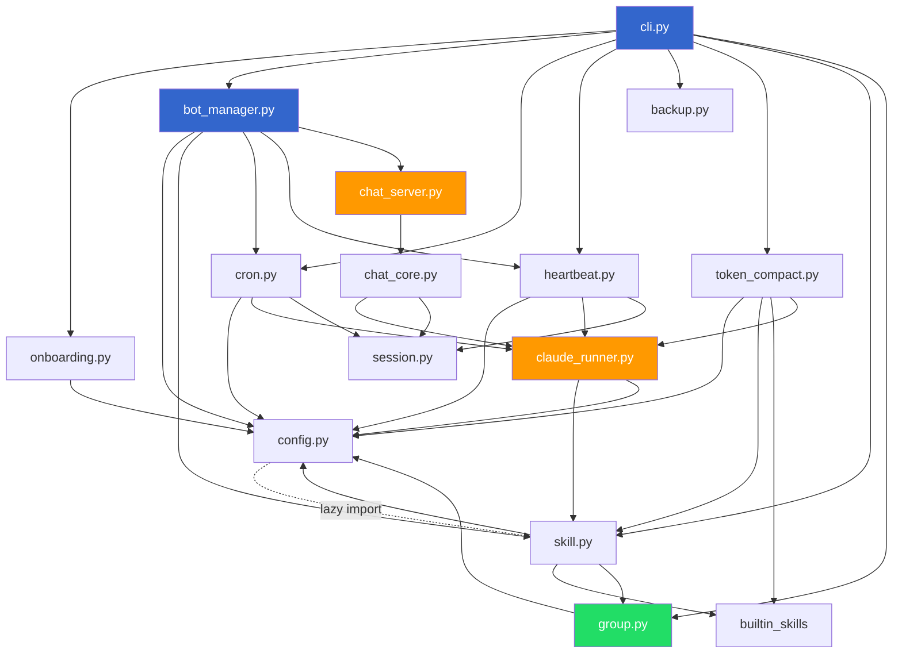
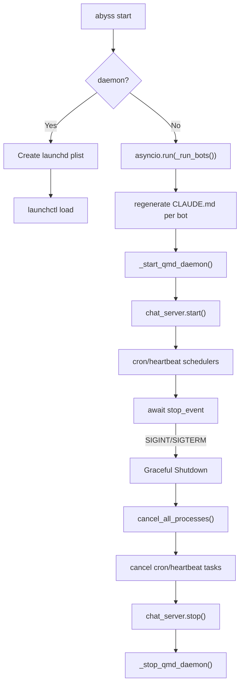
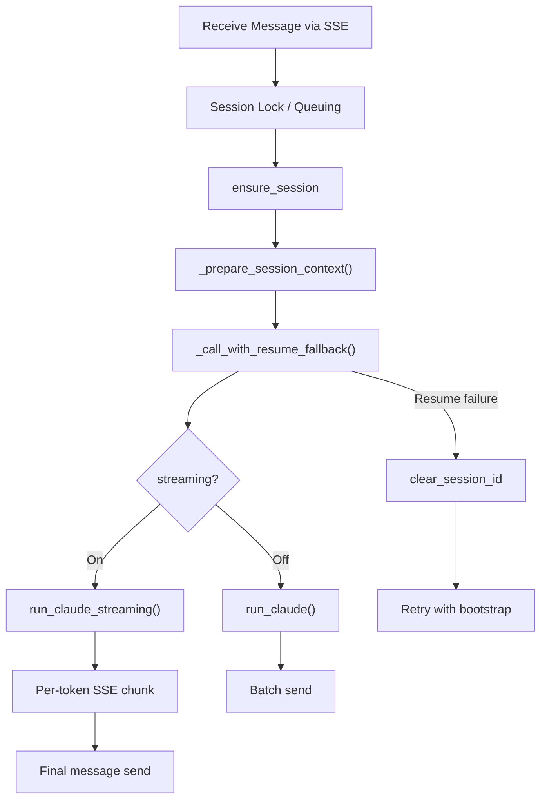
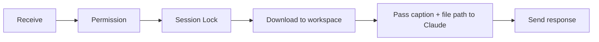
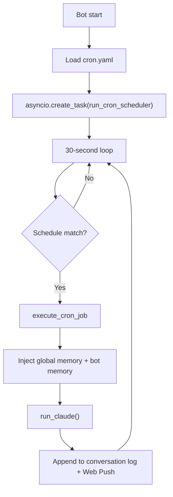
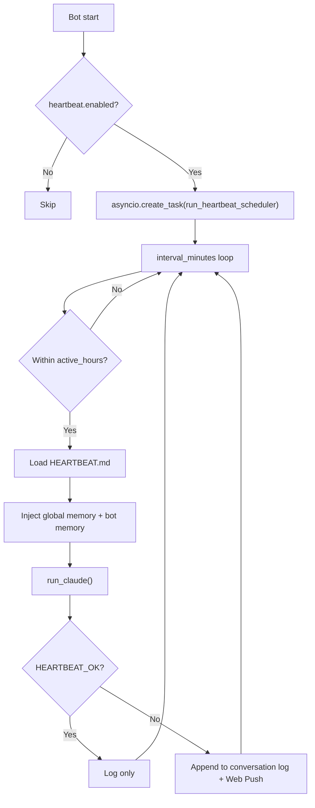

# Architecture

> **v2026.05.14** — Telegram and the group surface were removed.
> Wherever this doc still references Telegram polling, the
> `Application` lifecycle, group orchestrator/member routing, or
> `bot_to_bot_mode`, treat it as historical context — replaced by
> the PWA chat surface and the in-process `chat_server` (HTTP/SSE on
> 127.0.0.1:3848). The cron + heartbeat schedulers still run; their
> only delivery paths now are the conversation markdown log and
> Web Push.


## Overall Structure



### Claude Code Execution Paths



## Core Design Decisions

### 1. Claude Code Subprocess Delegation

Instead of calling the LLM API directly, we run the `claude -p` CLI as a subprocess.

- Leverages Claude Code's agent capabilities (file manipulation, code execution) as-is
- No API key management needed (Claude Code handles its own authentication)
- Sets session directory as working directory via subprocess `cwd` parameter
- Model selection via `--model` flag (sonnet/opus/haiku)

### 2. Python Agent SDK Client Pool

`SDKClientPool` in `sdk_client.py` keeps persistent `ClaudeSDKClient` instances per session key (`bot:chat_id`), avoiding process re-spawn on follow-up messages.

- **Purpose**: First message creates a `ClaudeSDKClient`; subsequent messages reuse the same process (~1-2s faster per message)
- **Architecture**: `claude_runner.py` -> `get_pool()` -> `SDKClientPool._get_or_create_client()` -> `ClaudeSDKClient.query()` + `receive_response()`
- **Lifecycle**: Pool is a module-level singleton created on first use. `bot_manager.py` calls `close_pool()` on shutdown before killing subprocesses
- **Session persistence**: `session_directory` parameter enables auto-load/save of `.claude_session_id`. When creating a new client, the saved session ID is used as `resume` option
- **Interrupt**: `/cancel` calls `pool.interrupt()` (sends interrupt to persistent client) before falling back to subprocess `kill()`
- **Reset**: `/reset` calls `pool.close_session()` to dispose the persistent client, ensuring a fresh client is created on next message
- **Fallback**: If SDK is unavailable (`claude-agent-sdk` not installed) or pool query fails (ConnectionError, RuntimeError), transparently falls back to `claude -p` subprocess execution. Broken sessions are auto-removed from pool

### 3. File-Based Sessions

Sessions are managed via directory structure without a database.

- Each chat is a `chat_<id>/` directory
- `CLAUDE.md`: System prompt read by Claude Code
- `conversation-YYMMDD.md`: Daily conversation log (UTC date rotation, markdown append). Legacy `conversation.md` supported as read fallback
- `workspace/`: File storage for Claude Code outputs

### 4. Bot Configuration (bot.yaml)

Each bot's configuration is stored in `~/.abyss/bots/<name>/bot.yaml`.

```yaml
display_name: "My Assistant"       # User-facing friendly name
telegram_botname: "My Bot"         # Legacy shim — fallback when display_name is empty
personality: "Friendly helper"     # Personality description (used in CLAUDE.md)
role: "General assistant"          # What the bot does (used in CLAUDE.md)
goal: "Help with daily tasks"     # Why the bot exists (used in CLAUDE.md, optional)
claude_args: []                    # Extra CLI args for claude -p
model: sonnet                      # Claude model (sonnet/opus/haiku, runtime-added)
streaming: false                   # Streaming response mode
skills:                            # Attached skill names (runtime-added)
  - imessage
  - reminders
heartbeat:                         # Heartbeat config
  enabled: false
  interval_minutes: 30
  active_hours:
    start: "07:00"
    end: "23:00"
backend:                           # Optional — defaults to claude_code
  type: openai_compat              # claude_code | openai_compat | openrouter (legacy)
  provider: openrouter             # openrouter | minimax | minimax_china
  api_key: sk-or-v1-...            # API key set directly in bot.yaml
  model: anthropic/claude-haiku-4.5
  max_history: 20                  # turns of history to replay
  max_tokens: 4096
```

### 5. Multi-Bot Architecture

Multiple bots run simultaneously in a single process, each serving independent PWA sessions.

- Per-bot independent configuration (personality, role, model, skills)
- Concurrent execution via `asyncio`
- Individual bot errors are isolated from other bots

### 6. Per-Session Concurrency Control

Sequential processing when multiple messages arrive in the same chat.

- `asyncio.Lock` managed by `{bot_name}:{chat_id}` key
- When lock is held, sends "Message queued" notification then waits (message queuing)

### 7. Process Tracking

Running Claude Code subprocesses are tracked per session.

- `_running_processes` dictionary maps `{bot_name}:{chat_id}` to subprocess
- `/cancel` command kills running process with SIGKILL
- `returncode == -9` raises `asyncio.CancelledError`

### 8. Model Selection

Per-bot Claude model configuration with runtime changes.

- Stored in `bot.yaml`'s `model` field (default: sonnet)
- Runtime change via `/model` slash command (immediately saved to bot.yaml)
- Also changeable via CLI `abyss bot model <name> <model>`
- Valid models: sonnet (4.5), opus (4.6), haiku (3.5) — `/model` shows version alongside name

### 9. Skill System

Extends bot capabilities by linking tools/knowledge. Skills are classified by origin:

- **Built-in skills** (`builtin`): Pre-packaged with abyss, installable via `abyss skills install <name>`
- **Custom skills** (`custom`): User-created via `abyss skills add`
- **Imported skills** (`custom`): Downloaded from GitHub via `abyss skills import <github-url>` or `/skills import <github-url>`

Internally, skills have different tool configurations:

- Minimum skill unit: folder + single `SKILL.md`
- **Markdown-only skills**: Just `SKILL.md` makes it immediately active. Adds knowledge/instructions to bot
- **Tool-based skills**: `skill.yaml` defines tool type (cli/mcp/browser), required commands, environment variables. Activated via `abyss skill setup`
- On skill attachment, `compose_claude_md()` merges bot prompt + skill content to regenerate CLAUDE.md
- MCP skills: Auto-generates `.mcp.json` in session directory. Environment variables injected via subprocess env
- CLI skills: Environment variables auto-injected during subprocess execution
- **Dual-layer permission defense**: `allowed_tools` in skill.yaml controls hard auto-approval (tools not listed are blocked in `-p` mode). SKILL.md provides soft guardrails for tools that are allowed but can be used destructively (e.g., `execute_sql` with DELETE statements)
- **Default allowed tools**: When the `--allowedTools` whitelist is active, `DEFAULT_ALLOWED_TOOLS` (WebFetch, WebSearch, Bash, Read, Write, Edit, Glob, Grep, Agent) are always included to prevent basic capabilities from being blocked by skill-specific tool lists

### 10. Cron Schedule Automation

Automatically runs Claude Code at scheduled times and appends results to conversation log + Web Push.

- Job list defined in `cron.yaml` (schedule or at)
- **Recurring jobs**: Standard cron expressions (`0 9 * * *` = daily at 9 AM)
- **One-shot jobs**: ISO datetime or duration (`30m`, `2h`, `1d`) in `at` field. Relative durations are converted to absolute ISO datetime at `add_cron_job()` time
- **Per-job timezone**: Optional `timezone` field (e.g., `Asia/Seoul`). Falls back to `config.yaml` timezone, then UTC. Cron expressions are evaluated in the job's timezone via `resolve_job_timezone()` using `zoneinfo.ZoneInfo`
- `croniter` library for cron expression validation and matching
- Scheduler loop: checks current time against job schedules every 30 seconds
- Duplicate prevention: records last run time in UTC, prevents re-execution within same minute
- Result delivery: appends to `conversation-YYMMDD.md` and delivers via Web Push. Falls back to scanning session chat IDs (`collect_session_chat_ids()`) to determine recipients
- Isolated working directory: Claude Code runs in `cron_sessions/{job_name}/`
- One-shot jobs: auto-deleted after execution when `delete_after_run=true`, auto-disabled when `delete_after_run=false`
- Inherits bot's skills/model settings, overridable at job level
- **Natural language creation**: `/cron add <description>` parses any language (Korean, English, Japanese, etc.) into cron jobs via Claude haiku one-shot (`parse_natural_language_schedule()`)
- **Timezone**: `resolve_default_timezone()` reads from `config.yaml` timezone (single source of truth, set during `abyss init`)
- **Unique naming**: `generate_unique_job_name()` appends `-2`, `-3` suffix on conflict
- **Message editing**: `edit_cron_job_message()` updates only the message field (name/schedule immutable). CLI: `abyss cron edit <bot> <job>` opens `$EDITOR`. Slash command: `/cron edit <name>` in the chat UI. `pending_cron_edits` dict in handler tracks in-flight edits by chat_id
- **Slash command CRUD**: `/cron list|add|edit|run|remove|enable|disable`

### 11. Heartbeat (Periodic Situation Awareness)

Proactive agent feature that periodically wakes Claude Code to run HEARTBEAT.md checklist and only notifies when there's something to report.

- Configured in `bot.yaml`'s `heartbeat` section (one per bot)
- **interval_minutes**: Execution interval (default 30 minutes)
- **active_hours**: Active time range (HH:MM, uses config.yaml timezone, midnight-crossing supported)
- `HEARTBEAT.md`: User-editable checklist template
- **HEARTBEAT_OK detection**: When response contains `HEARTBEAT_OK` marker, only logs without notification
- When HEARTBEAT_OK is absent: appends result to `conversation-YYMMDD.md` and delivers via Web Push
- Uses all skills linked to the bot (no separate skill list for heartbeat)
- Scheduler loop re-reads `bot.yaml` every cycle for runtime config changes
- Isolated working directory: Claude Code runs in `heartbeat_sessions/`

### 12. Built-in Skill System

Frequently used skills are bundled as templates inside the package, installable via `abyss skills install`.

- Skill templates stored in `src/abyss/builtin_skills/` directory (SKILL.md, skill.yaml, etc.)
- `builtin_skills/__init__.py` scans subdirectories to provide a registry
- `install_builtin_skill()` copies template files to `~/.abyss/skills/<name>/`
- After installation: requirement check -> auto-activate on pass, stays inactive with guidance on fail
- `skill.yaml`'s `install_hints` field provides installation instructions for missing tools
- Built-in skills cover universal tooling only — domain/region-specific skills are expected to be authored or imported by users via `abyss skills import <github-url>`. Bundled set: iMessage (`imsg` CLI), Apple Reminders (`reminders-cli`), Image Processing (`slimg` CLI), Supabase (MCP type, DB/Storage/Edge Functions with no-deletion guardrails), Gmail (`gogcli`), Google Calendar (`gogcli`), Twitter/X (MCP type, tweet posting/search via `@enescinar/twitter-mcp`), Jira (MCP type, issue management via `mcp-atlassian`), Translate (`translatecli`, Gemini-powered text/transcript translation), QMD (MCP type, markdown knowledge search via HTTP daemon, auto-injected system-wide), plus internal helpers (`code_review`, `conversation_search`)
- `abyss skills` command shows all skills with origin type (builtin/custom), including uninstalled builtins
- Slash `/skills` shows origin type (builtin/custom) and uninstalled builtins in the chat UI
- **GitHub import**: `import_skill_from_github(url, name)` downloads SKILL.md (required) + skill.yaml + mcp.json (optional) from a GitHub repo. `parse_github_url()` parses owner/repo/branch/subdir. Tries `main` branch first, falls back to `master`. Compatible with [skills.sh](https://skills.sh) skill packages. CLI: `abyss skills import <url> [--skill <name>]`. Slash: `/skills import <url> [name]` — imports and auto-attaches to the bot in one step.

### 13. QMD Auto-Injection (System-Wide Knowledge Search)

QMD (local markdown search engine) is automatically available to all bots when the `qmd` CLI is installed — no skill attachment or installation needed.

- **Auto-detect**: `shutil.which("qmd")` checks if QMD CLI is available on the system
- **MCP config injection**: `_prepare_skill_config()` in `claude_runner.py` auto-injects QMD HTTP MCP server config (`localhost:8181/mcp`) and allowed tools into every session, regardless of skill attachment
- **CLAUDE.md injection**: `compose_claude_md()` in `skill.py` auto-appends QMD SKILL.md instructions from the builtin template. Deduplicates if qmd is also attached as a skill
- **HTTP daemon**: `bot_manager.py` starts QMD daemon (`qmd mcp --http --daemon`) on `abyss start` and stops it (`qmd mcp stop`) on shutdown. Self-managed by QMD — no Popen/pipe management needed
- **Health check**: TCP connection to `localhost:8181` to verify daemon readiness (up to 30 retries with 1s sleep)
- **Collection auto-setup**: `_ensure_qmd_conversations_collection()` registers `abyss-conversations` collection pointing to `~/.abyss/bots/` with `**/conversation-*.md` glob on startup
- **Test isolation**: `tests/conftest.py` autouse fixture patches `shutil.which` to return `None` for `"qmd"`, preventing auto-injection in tests. QMD-specific tests in `test_qmd.py` override with explicit mocking

### 13.5. Conversation Search (SQLite FTS5)

`conversation_search` is a built-in MCP tool that gives Claude full-text recall over the user's past messages. Markdown logs (`conversation-YYMMDD.md` for bots, `YYMMDD.md` for groups) remain the source of truth — the FTS5 SQLite database is a parallel cache that can be rebuilt at any time with `abyss reindex`.

- **Storage**: `~/.abyss/bots/<name>/conversation.db` per bot, `~/.abyss/groups/<name>/conversation.db` per group. Single virtual `messages` table tokenized as `unicode61 + remove_diacritics 2`. Schema versioned.
- **Append on log**: `session.log_conversation()` mirrors each markdown write into the index. Failures log a warning and never raise — markdown is canonical.
- **MCP server**: `abyss.mcp_servers.conversation_search` is a stdio JSON-RPC server. One tool: `search_conversations(query, since=, until=, chat_id=, role=, limit=)`. Reads its DB path from `ABYSS_CONVERSATION_DB`.
- **Auto-injection**: `compose_claude_md()` appends the built-in `conversation_search/SKILL.md` whenever `is_fts5_available()` is True. `_prepare_skill_config()` writes per-session `.mcp.json` with the bot's DB path. The bot directory is resolved by `_resolve_bot_dir_from_working_directory()` walking up the working directory's parents until it finds an entry whose parent is named `bots`, so DM (`bots/<name>/sessions/chat_*`), cron (`bots/<name>/cron_sessions/<job>`) and heartbeat (`bots/<name>/heartbeat_sessions/`) flows all hit the same per-bot DB.
- **Reindex semantics**: `reindex_session_dir` and `reindex_group_dir` always wipe the FTS5 table — even when the source markdown directory is missing — so deleting source content actually purges the index.
- **Reindex**: `abyss reindex --bot|--group|--all` wipes and rebuilds from markdown.
- **Bot startup**: `bot_manager._ensure_conversation_index()` runs `ensure_schema` for the bot DB and every group it belongs to.
- **Test isolation**: autouse fixture in `tests/conftest.py` stubs `is_fts5_available()` to False; opt-in tests use `@pytest.mark.enable_conversation_search`.
- **Limits**: BM25 keyword only (no semantic / embedding). No Korean morpheme analysis (prefix matches only). Group DB is indexed but the auto-injected MCP currently exposes only the bot's DB.

### 13.6. LLM Backend Abstraction

abyss routes every model call through `abyss.llm.LLMBackend`. New backends drop in by registering a class with `abyss.llm.register`.

- **`claude_code` (default)** — `ClaudeCodeBackend` wraps `claude_runner.run_claude_with_sdk` and `run_claude_streaming_with_sdk`. Full agent capabilities preserved: built-in tools, MCP, skills, `/resume`, `/cancel`. No bot.yaml change required.
- **`openai_compat` (opt-in)** — `OpenAICompatBackend` in `llm/openai_compat.py`. Talks to any OpenAI-compatible chat completions endpoint via `httpx`. Text-only: no tool invocation, no MCP, no `/resume` continuity. Conversation history replayed from `conversation-YYMMDD.md` (capped at `max_history`); `CLAUDE.md` sent as system prompt. Built-in `PROVIDER_PRESETS` for `openrouter`, `minimax` (international), `minimax_china`.
- **`openrouter` (backward-compat alias)** — `OpenRouterBackend` in `llm/openrouter.py` is a thin subclass of `OpenAICompatBackend` with `type="openrouter"` and `_default_provider="openrouter"`. Existing `bot.yaml` files with `type: openrouter` continue to work unchanged.
- **Per-bot selection** via `bot.yaml`:

  ```yaml
  # OpenRouter
  backend:
    type: openai_compat
    provider: openrouter
    api_key: sk-or-v1-...           # set directly in bot.yaml
    model: anthropic/claude-haiku-4.5
    max_history: 20
    max_tokens: 4096

  # MiniMax (direct)
  backend:
    type: openai_compat
    provider: minimax
    api_key: your-minimax-api-key   # set directly in bot.yaml
    model: minimax-text-01
    max_history: 20
    max_tokens: 4096
  ```

- **Per-bot caching** — `get_or_create(bot_name, bot_config)` keeps one backend instance per bot for the process lifetime so HTTPX clients / SDK pools are shared across handler / cron / heartbeat call sites. The instance's `bot_config` is refreshed on each lookup so config changes take effect without process restart (backend type changes still recreate).
- **Cancellation** — `/cancel` looks up the cached backend (`cached_backend(bot_name)`) and calls `backend.cancel(session_key)`. Falls through to legacy Claude Code cancel paths for bots that haven't yet warmed up a backend.
- **Shutdown** — `bot_manager` calls `abyss.llm.close_all()` before stopping the SDK pool so HTTPX clients release sockets cleanly.
- **User-message dedup** — abyss handlers call `log_conversation` *before* `backend.run`, so the markdown log already contains the current user message. `OpenAICompatBackend._build_messages` drops a trailing user turn whose content matches `request.user_prompt` to avoid sending the same input twice.
- **`max_history` precedence** — explicit caller override (above the dataclass default of 20) wins, otherwise `bot.yaml`'s `backend.max_history` is honored, otherwise the dataclass default applies. `_load_history` reads `cap + 1` so dedup never trims below the configured window.
- **Tests** — `tests/conftest.py::clear_llm_backend_cache` autouse fixture wipes the per-bot cache between tests. End-to-end OpenRouter tests under `tests/evaluation/test_openrouter_e2e.py` are gated on `OPENROUTER_API_KEY` and excluded from CI.

### 13.7. Dashboard Chat (Internal HTTP/SSE Server)

Abysscope can talk to bots in the browser via the same SDK pool used by the PWA. To keep the dashboard purely a Next.js client, abyss runs an internal aiohttp server (`chat_server.py`) inside the `bot_manager` process.

- **Lifecycle** — `bot_manager` constructs `get_server()` (singleton) before polling starts and stops it on shutdown. Bound to `127.0.0.1:CHAT_SERVER_PORT` and protected by an Origin allowlist + CORS middleware so only the local dashboard can call it
- **Routes** — `/health`, `/bots`, `/sessions` (list/create/delete), `/messages` (parsed conversation log), `/chat` (SSE token stream), `/upload` (multipart with MIME sniffing), `/files/{id}` (inline serve), `/cancel`
- **Concurrency** — per-session asyncio locks for chat (sequential turns) and a separate per-session upload lock. Path traversal is blocked by validating bot/session names and `_is_path_under` checks
- **Session reuse** — `chat_core.process_chat_message` reuses the SDK pool client keyed by `bot:chat_id`, so the mobile PWA and dashboard share the same persistent Claude session when using the same chat ID. Bootstrap fallback runs the same `_run_with_resume_fallback` path
- **Attachments** — uploads land in `sessions/chat_<id>/uploads/<8hex>__<safe>.<ext>` and are referenced from the user turn in the same format as file handlers, so the conversation log is identical regardless of source
- **Display names** — `/chat/bots` and `/chat/sessions` both apply the fallback chain `display_name → telegram_botname (legacy shim) → bot_name` (`_bot_display_name` in `chat_server.py`), matching the dashboard sidebar so a bot whose `display_name` is empty still shows a human-readable name in the chat picker, session list, and message header
- **UX** — the dashboard chat has a single entry point: the left sidebar shows a `Chats` panel with a `New` button. `New` opens a base-ui `Menu` listing every bot; clicking one immediately creates a `chat_web_<uuid>` session and selects it. The right-panel header carries no controls — only the active session's bot avatar, display name, and session ID. The previous `BotSelector` + `Start chat` button in the right panel was removed to eliminate the two-step flow

### 13.8. Voice Mode (STT/TTS)

The dashboard chat mic button triggers a full duplex voice loop: speech → transcript → LLM reply → synthesized audio.

- **Frontend hook** (`use-voice-mode.ts`) manages the state machine: `idle → recording → processing → speaking → idle`. After speaking ends, it auto-restarts recording so the user can speak again without pressing anything
- **STT** — ElevenLabs Scribe v2 WebSocket. The frontend obtains a short-lived signed token from `/api/chat/scribe-token` (Next.js proxy → `chat_server.py` `/scribe-token`). A `WebSocket` connects directly to `wss://api.elevenlabs.io/v1/speech-to-text/stream-input`. Audio chunks are sent in 250 ms slices; the server returns `partial_transcript` and `final_transcript` events. On final transcript the hook calls `onTranscript(text)`
- **`voice_mode` flag** — `onTranscript` calls `handleSubmit` with `voiceMode: true`. `use-chat-stream.ts` forwards `body.voice_mode = true` to `/api/chat`. `chat_server.py` `_handle_chat` extracts `voice_mode` and appends a spoken-style instruction telling the bot to respond in natural conversational Korean without markdown or bullets
- **TTS** — after the SSE stream completes, `voice.speak(text)` calls `/api/chat/speak` which proxies to ElevenLabs `/v1/text-to-speech/{voice_id}/stream`. MP3 bytes are piped back and decoded/played via the Web Audio API
- **Shared `aiohttp.ClientSession`** — `chat_server.py` creates one session in `start()` and shares it across `/transcribe`, `/speak`, and `/scribe-token` handlers; closed in `stop()`. Tests inject a `MagicMock` directly onto `server_instance._http_session` since `TestServer` does not call `start()`
- **Orb UI** — right sidebar `VoiceScreen` component uses `ElevenLabs Orb` (`@11labs/react`). `agentState` maps `recording→listening`, `processing→thinking`, `speaking→talking`. `colors` prop is theme-aware via `useTheme` from `next-themes`: dark mode → `["#cccccc", "#ffffff"]`, light mode → `["#111111", "#2a2a2a"]`

### 14. Session Continuity

Each message runs `claude -p` as a new process, but maintains conversation context.

- **First message**: Starts new Claude Code session with `--session-id <uuid>`
  - Bootstrap prompt order: global memory -> bot memory -> last 20 turns from conversation files -> new message
- **Subsequent messages**: Continues session with `--resume <session_id>`
- **Fallback**: Auto-retries with bootstrap when `--resume` fails (session expired). Fallback uses same bootstrap order (global memory -> bot memory -> conversation history -> message)
- **Reset**: `/reset`, `/resetall` also delete session ID
- Session ID stored as UUID in `sessions/chat_<id>/.claude_session_id`
- `_prepare_session_context()`: Decides resume/bootstrap
- `_call_with_resume_fallback()`: Handles fallback on resume failure
- Cron and heartbeat: one-shot executions with global memory + bot memory injected into prompt

### 15. Bot-Level Long-Term Memory

When user requests "remember this", the bot saves to `MEMORY.md` and injects it into the prompt on new session bootstrap for persistent memory.

- `MEMORY.md` managed per bot (`~/.abyss/bots/<name>/MEMORY.md`). All chat sessions share the same memory
- **Save mechanism**: `compose_claude_md()` includes memory instructions + MEMORY.md absolute path in CLAUDE.md -> Claude Code writes to MEMORY.md directly via file write tool
- **Load mechanism**: `_prepare_session_context()` reads `load_global_memory()` + `load_bot_memory()` during bootstrap -> prompt injection (global memory -> bot memory -> conversation history -> new message order)
- `--resume` sessions don't inject memory separately (Claude Code session maintains its own context)
- Management: Telegram `/memory` (show), `/memory clear` (reset), CLI `abyss memory show|edit|clear`
- CRUD functions in `session.py`: `memory_file_path()`, `load_bot_memory()`, `save_bot_memory()`, `clear_bot_memory()`

### 16. Global Memory

Shared read-only memory accessible by all bots, managed via CLI only.

- `GLOBAL_MEMORY.md` stored at `~/.abyss/GLOBAL_MEMORY.md`
- Stores user preferences and other information all bots should reference (timezone is managed in config.yaml, not here)
- **CLAUDE.md injection**: `compose_claude_md()` inserts a "Global Memory (Read-Only)" section without the file path, preventing Claude from modifying it. Placed before bot Memory section
- **Bootstrap injection**: `_prepare_session_context()` and `_call_with_resume_fallback()` inject global memory before bot memory (global memory -> bot memory -> conversation history -> message)
- **Cron/Heartbeat injection**: `execute_cron_job()` and `execute_heartbeat()` inject global memory + bot memory into prompt before execution
- **CLI management**: `abyss global-memory show|edit|clear`. Editing or clearing regenerates all bots' CLAUDE.md and propagates to sessions
- Not editable via slash command (no file path exposed, CLI only)
- CRUD functions in `session.py`: `global_memory_file_path()`, `load_global_memory()`, `save_global_memory()`, `clear_global_memory()`

### 17. Streaming Response

Delivers Claude Code output to the PWA / dashboard in real-time. User-toggleable on/off.

- Controlled by `streaming` field in `bot.yaml` (default: `DEFAULT_STREAMING = False`)
- Runtime toggle via `/streaming on|off` slash command or CLI `abyss bot streaming <name> on|off`
- **Streaming mode** (`_send_streaming_response`):
  - `run_claude_streaming()`: Runs with `--output-format stream-json --verbose --include-partial-messages`
  - Extracts `text_delta` from stream-json `content_block_delta` events for per-token streaming
  - `on_text_chunk` callback forwards chunks to SSE stream
  - Cursor marker (`▌`) shows progress; 0.5s throttle on edit operations
  - On completion, replaces draft with final markdown-rendered text
  - Fallback: Uses accumulated streaming text or `assistant` turn text if no `result` event
- **Non-streaming mode** (`_send_non_streaming_response`):
  - `run_claude()`: Batch send on completion — same pattern as cron and heartbeat

### 18. Token Compact

Compresses bot MD files (MEMORY.md, user-created SKILL.md, HEARTBEAT.md) via one-shot `claude -p` calls to reduce token costs.

- **Targets**: MEMORY.md, user-created SKILL.md (builtins excluded via `is_builtin_skill()`), HEARTBEAT.md
- **Execution**: Sequential per-target with error isolation — individual failures don't stop remaining targets
- **Working directory**: Each compaction runs in a `tempfile.TemporaryDirectory()` (no session state needed)
- **Token estimation**: `chars // 4` heuristic for relative before/after comparison
- **Post-save**: After saving compacted files, `regenerate_bot_claude_md()` + `update_session_claude_md()` propagate changes
- **CLI**: `abyss bot compact <name>` with `--yes/-y` skip confirmation
- **Telegram**: `/compact` auto-saves on success

### 19. Encrypted Backup

Full backup of `~/.abyss/` directory to an AES-256 encrypted zip file.

- `abyss backup` generates `YYMMDD-abyss.zip` in the current working directory
- Password input via `getpass.getpass()` (masked, confirmed twice)
- Encryption via `pyzipper` (AES-256, WZ_AES mode)
- Excludes runtime artifacts: `abyss.pid`, `__pycache__/`
- Same-day backup prompts for overwrite confirmation

### 20. Group Collaboration (Orchestrator Pattern)

> **Removed in v2026.05.14.** Group collaboration shipped on top of Telegram and was retired with it.
> The data model (`group.yaml`, shared conversation log, shared workspace) and CLI commands
> (`abyss group create/list/show/delete`) are preserved for a future PWA-based re-implementation.
> `group.py` and `session.group_session_directory()` remain in the codebase as stubs.

## Module Dependencies



## Process Management



- **PID file**: Records current process ID in `~/.abyss/abyss.pid`
- **Graceful Shutdown**: Without killing subprocesses first, `application.stop()` would wait for running handlers (up to `command_timeout` seconds)

## Message Processing Flow

### Text Messages



### Files (Photos/Documents)



### Cron Scheduler



### /cron add (Natural Language)


### Heartbeat Scheduler



### Group Message Routing

> **Removed in v2026.05.14.** The orchestrator/member routing diagram belonged to the Telegram group
> surface which has been retired. Group re-implementation on top of the PWA is planned for a future release.
